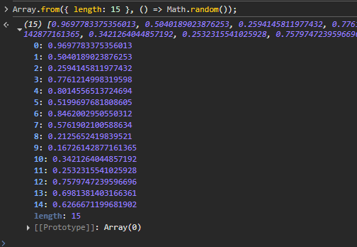
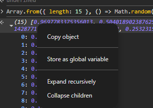
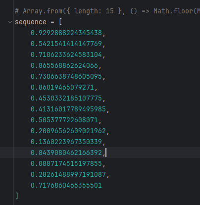

# 🔮 V8 XorShift128+ Seed State Solver

This Python script reverse-engineers the internal seed state of Chrome's V8 JavaScript engine’s `Math.random()` function, which uses the **XorShift128+** PRNG. By analyzing a sequence of random numbers (float or integer), it predicts the next output.

## 📚 What This Does

Given a list of 15 numbers generated by:

```js
Array.from({ length: 15 }, () => Math.random());
```

or:

```js
Array.from({ length: 15 }, () => Math.floor(Math.random() * 5000));
```

This script uses **Z3 SMT solver** to:
- Reconstruct the internal 128-bit state of V8’s RNG.
- Predict the **next float or integer** that `Math.random()` will generate.

## 🚀 How to Use

### 1. Install Dependencies

Make sure you have Python 3 and install the required packages:

```bash
pip install z3-solver numpy
```

### 2. Open google chrome console and type the following
```javascript
Array.from({ length: 15 }, () => Math.random());
```





### 3. Edit the `sequence` list in the script with your 15 known outputs from `Math.random()`.



### 4. Run the Script

```bash
python3 predict_v8_random.py
```

Set `USE_MULTIPLIER = True` if using float values in [0, 1).  
Set it to `False` if using integers like `Math.floor(Math.random() * 5000)`.

### 5. Example Output

- The internal RNG state recovered
- Whether the solution is unique
- The next predicted float or integer

## 🧠 How It Works

- V8 uses XorShift128+ internally for randomness.
- This script models XorShift128+ in reverse using bit constraints.
- Z3 SMT solver is used to find the seed state matching the observed outputs.

## ⚠️ Disclaimer

This is for educational and security research purposes only. Don't use it to exploit systems.

## 📄 License

MIT License
